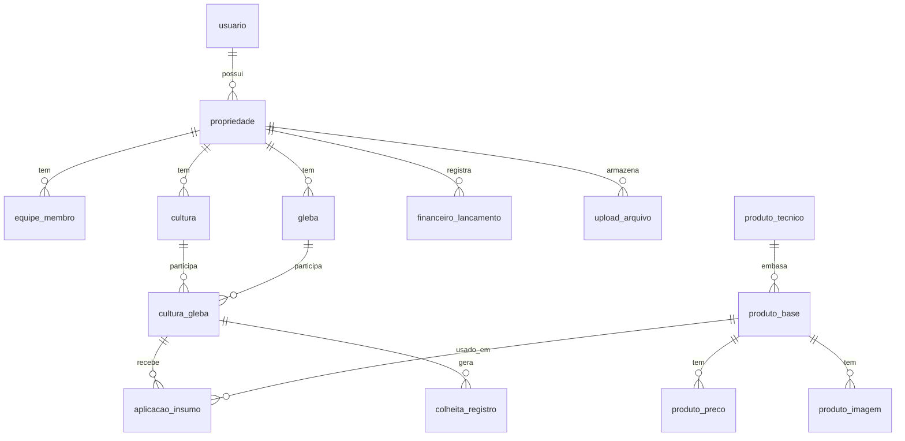

# 04 — Modelagem do Banco (DER)

## Status do documento

**DER preliminar — v0.1 (MVP).**

Este documento descreve a primeira modelagem de dados do ConnectAgro e serve de
base para a futura implementação do banco em **SQLite**. Ele **ainda não** é um
schema final: nomes, tipos, chaves e cardinalidades podem ser refinados nas
próximas etapas, à medida que escopo e regras de negócio amadurecem. Nenhuma
migration, seed ou banco real é criado nesta etapa.

## Objetivo

Definir as **entidades**, seus **atributos principais** e os **relacionamentos**
entre elas, cobrindo os módulos do MVP: gestão e acesso, operação agrícola,
catálogo de produtos e financeiro/arquivos/apoio.

## Convenções

- Nomes de **tabelas** e **colunas** em `snake_case`.
- Toda tabela principal possui uma chave primária `id` (INTEGER, autoincremento).
- Datas e datas/horas seguem o padrão **ISO 8601** (ex.: `2026-06-25`,
  `2026-06-25T14:30:00`).
- Campos **opcionais** podem ser `NULL`.
- Chaves estrangeiras seguem o padrão `<entidade>_id` (ex.: `propriedade_id`).
- **Preço e imagem de produtos são pendências no MVP** — quando sem fonte
  confiável, ficam `NULL` e marcados como **não consolidados** (`consolidado = 0`).
- A **validação diária do menor preço atualizado** fica para o **sistema final**;
  o MVP apenas registra preços de referência para consulta rápida.
- **Validação regulatória AGROFIT/MAPA não deve ser presumida.** O catálogo é uma
  **base técnica inicial**, não uma verdade regulatória definitiva, e o modelo
  não afirma validação oficial sem fonte real.
- O ConnectAgro **não vende produtos**; não há entidades de carrinho, pedido ou
  checkout.

---

## Entidades principais do MVP

As entidades estão agrupadas por domínio. Os atributos listados são os
**principais** previstos para o MVP (não exaustivos).

### Gestão e acesso

#### `usuario`
Usuários que acessam o sistema (autenticação e dono das propriedades).

- `id` — PK.
- `nome` — nome do usuário.
- `email` — e-mail de login (único).
- `senha_hash` — hash da senha (nunca em texto puro).
- `ativo` — indica se o usuário está ativo.
- `criado_em`, `atualizado_em` — controle temporal.

#### `propriedade`
Propriedade rural gerida no sistema. Um usuário pode ter mais de uma.

- `id` — PK.
- `usuario_id` — FK → `usuario` (dono/responsável).
- `nome` — nome da propriedade/fazenda.
- `municipio`, `uf` — localização (opcionais no MVP).
- `area_total_ha` — área total em hectares (opcional).
- `criado_em` — controle temporal.

#### `equipe_membro`
Membros da equipe vinculados a uma propriedade e suas funções.

- `id` — PK.
- `propriedade_id` — FK → `propriedade`.
- `nome` — nome do membro.
- `funcao` — função/papel (ex.: gestor, operador) — pode condicionar permissões
  no futuro.
- `email`, `telefone` — contato (opcionais).
- `ativo` — indica se o membro está ativo.
- `criado_em` — controle temporal.

### Operação agrícola

#### `cultura`
Cultura cadastrada na propriedade (ex.: soja, milho).

- `id` — PK.
- `propriedade_id` — FK → `propriedade`.
- `nome` — nome da cultura.
- `variedade` — variedade/cultivar (opcional).
- `safra` — identificação da safra (opcional, ex.: `2025/2026`).
- `criado_em` — controle temporal.

#### `gleba`
Área/talhão da propriedade.

- `id` — PK.
- `propriedade_id` — FK → `propriedade`.
- `nome` — identificação da gleba/talhão.
- `area_ha` — área em hectares.
- `geometria` — dados geográficos para o mapa (opcional no MVP; formato a
  definir, ex.: GeoJSON em texto).
- `criado_em` — controle temporal.

#### `cultura_gleba`
Tabela associativa que liga **culturas** a **glebas** (relação N:N), registrando
o uso de uma gleba por uma cultura em um período.

- `id` — PK.
- `cultura_id` — FK → `cultura`.
- `gleba_id` — FK → `gleba`.
- `data_inicio` — início do plantio/uso (opcional).
- `data_fim` — fim do ciclo (opcional, `NULL` enquanto ativo).

#### `aplicacao_insumo`
Registro de aplicação de um insumo (produto do catálogo) em uma cultura/gleba.

- `id` — PK.
- `cultura_gleba_id` — FK → `cultura_gleba` (onde foi aplicado).
- `produto_base_id` — FK → `produto_base` (o que foi aplicado).
- `data_aplicacao` — data da aplicação.
- `dose` — quantidade aplicada (opcional).
- `unidade` — unidade da dose (ex.: kg/ha, L/ha) (opcional).
- `observacao` — texto livre (opcional).
- `criado_em` — controle temporal.

#### `colheita_registro`
Registro de colheita associado a uma cultura/gleba.

- `id` — PK.
- `cultura_gleba_id` — FK → `cultura_gleba`.
- `data_colheita` — data da colheita.
- `quantidade` — quantidade colhida (opcional).
- `unidade` — unidade (ex.: sacas, ton) (opcional).
- `observacao` — texto livre (opcional).
- `criado_em` — controle temporal.

### Catálogo de produtos

> O catálogo é **base técnica inicial de consulta rápida**. Modelado de forma
> **expansível** para defensivos, fertilizantes, corretivos, inoculantes e
> biofertilizantes. Fertilizantes como Ureia, MAP, DAP e Calcário Dolomítico
> existem no MVP como **tipo técnico/genérico** (ver `produto_tecnico`) e poderão,
> no sistema final, ser separados de produtos comerciais específicos.

#### `produto_base`
Linha central do produto no catálogo. No MVP representa, em geral, um item
técnico/genérico; o modelo já prevê produtos comerciais específicos no futuro.

- `id` — PK.
- `categoria` — categoria do produto: `defensivo`, `fertilizante`, `corretivo`,
  `inoculante`, `biofertilizante` (expansível).
- `nome` — nome do produto/insumo.
- `produto_tecnico_id` — FK → `produto_tecnico` (opcional; tipo técnico associado).
- `fabricante` — fabricante (opcional; `NULL` para itens genéricos no MVP).
- `tipo_registro` — distingue item `tecnico_generico` (padrão no MVP) de
  `comercial` (uso futuro).
- `descricao` — descrição técnica (opcional).
- `criado_em` — controle temporal.

#### `produto_tecnico`
Catálogo dos **tipos técnicos/genéricos** (ex.: Ureia, MAP, DAP, Calcário
Dolomítico), permitindo separar a base técnica de produtos comerciais no futuro.

- `id` — PK.
- `categoria` — mesma classificação de `produto_base`.
- `nome_tecnico` — nome do tipo técnico/genérico.
- `composicao` — composição/descrição técnica (ex.: teores NPK) (opcional).
- `descricao` — observações (opcional).

#### `produto_preco`
Preço de **referência** de um produto, apenas para **consulta rápida**.

- `id` — PK.
- `produto_base_id` — FK → `produto_base`.
- `valor` — valor de referência (**opcional / pendência**; `NULL` se não
  consolidado).
- `moeda` — moeda (ex.: `BRL`) (opcional).
- `fonte` — origem do dado (opcional; obrigatório para considerar consolidado).
- `data_referencia` — data a que o valor se refere (opcional).
- `consolidado` — booleano; `0` = pendência / dado não consolidado (padrão no MVP).

> A validação diária do **menor valor** entre fontes é responsabilidade do
> **sistema final**, não do MVP.

#### `produto_imagem`
Imagem de um produto. **Pendência no MVP.**

- `id` — PK.
- `produto_base_id` — FK → `produto_base`.
- `caminho` — caminho/URL da imagem (**opcional / pendência**; `NULL` se
  indisponível).
- `fonte` — origem da imagem (opcional).
- `consolidado` — booleano; `0` = pendência (padrão no MVP).

### Financeiro, arquivos e apoio

#### `financeiro_lancamento`
Lançamento financeiro (receita ou despesa) da propriedade.

- `id` — PK.
- `propriedade_id` — FK → `propriedade`.
- `tipo` — `receita` ou `despesa`.
- `categoria` — categoria do lançamento (opcional).
- `descricao` — descrição (opcional).
- `valor` — valor do lançamento.
- `data` — data do lançamento.
- `criado_em` — controle temporal.

#### `upload_arquivo`
Documentos/arquivos enviados via módulo de upload.

- `id` — PK.
- `propriedade_id` — FK → `propriedade`.
- `nome_original` — nome do arquivo enviado.
- `caminho` — caminho de armazenamento.
- `tipo_mime` — tipo do arquivo (opcional).
- `tamanho` — tamanho em bytes (opcional).
- `enviado_em` — data/hora do upload.

---

## Relacionamentos

- `usuario` **1:N** `propriedade`.
- `propriedade` **1:N** `equipe_membro`, `cultura`, `gleba`,
  `financeiro_lancamento`, `upload_arquivo`.
- `cultura` **N:N** `gleba`, através de `cultura_gleba`.
- `cultura_gleba` **1:N** `aplicacao_insumo` e **1:N** `colheita_registro`.
- `produto_base` **1:N** `aplicacao_insumo`.
- `produto_tecnico` **1:N** `produto_base` (um tipo técnico pode embasar vários
  produtos — incluindo, no futuro, comerciais específicos).
- `produto_base` **1:N** `produto_preco` e **1:N** `produto_imagem`.

## Diagrama (visão preliminar)

> Diagrama textual em [Mermaid](https://mermaid.js.org/). É uma representação de
> apoio da v0.1, não o schema final.

---

## Pendências e decisões em aberto

- Formato definitivo do campo `geometria` da gleba (mapa real).
- Modelo de **permissões** por função em `equipe_membro`.
- Estrutura de armazenamento de **preço/imagem** quando deixarem de ser pendência
  (sistema final).
- Eventual separação formal entre **produto técnico/genérico** e **produto
  comercial** no catálogo.

## Documentos relacionados

- [03 — Regras de Negócio](./03-regras-de-negocio.md)
- [05 — Dicionário de Dados](./05-dicionario-de-dados.md)
- [06 — Arquitetura do Sistema](./06-arquitetura-do-sistema.md)
