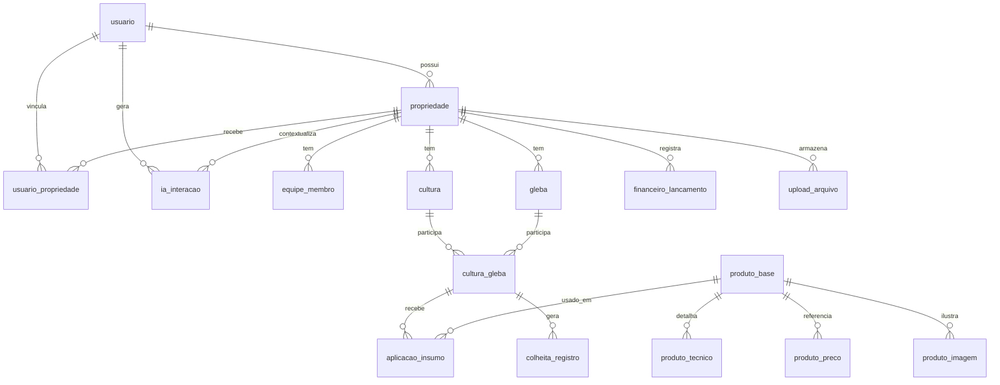

# 04 — Modelagem do Banco (DER)

## Status do documento

**DER do MVP — v0.4 (alinhado aos modelos SQLAlchemy implementados, incluindo Fase 7.1).**

Este documento descreve a modelagem de dados do ConnectAgro e serve como
**referência documental dos modelos SQLAlchemy já implementados** em
`src/app/models/`. O schema deve ser evoluído por migrations
(`flask --app src/run.py db upgrade`) ou criado localmente via `flask init-db` em
uso pontual. Refinamentos ainda são possíveis em etapas futuras; o banco real
não é versionado.

## Objetivo

Definir as **entidades**, seus **atributos** e os **relacionamentos** do
ConnectAgro, cobrindo os módulos do MVP: gestão e acesso, painel de usuários,
operação agrícola, catálogo de produtos, financeiro, upload e IA simulada.

## Convenções

- Nomes de **tabelas** e **colunas** em `snake_case`.
- Toda tabela principal possui chave primária `id` (INTEGER, autoincremento).
- Datas e datas/horas seguem o padrão **ISO 8601** e são armazenadas como `TEXT`
  (ex.: `2026-06-25`, `2026-06-25T14:30:00`).
- Campos **opcionais** podem ser `NULL`.
- **Booleanos** são documentados como `BOOLEAN` e armazenados como `0`/`1`.
- Chaves estrangeiras seguem o padrão `<entidade>_id` (ex.: `propriedade_id`).
- Campos que representam **listas** podem ser `TEXT` contendo **JSON** no MVP,
  com normalização prevista para o futuro.
- **Preço e imagem de produtos são pendências no MVP** — ficam `NULL` e com
  `status_validacao` indicando `pendente` / `nao_consolidado`. Nunca preencher
  com dados inventados.
- A **validação diária do menor preço** fica para o **sistema final**; o MVP não
  consolida preço.
- **Validação regulatória AGROFIT/MAPA não é presumida.** O catálogo é uma
  **base técnica inicial**, não uma base regulatória definitiva.
- O ConnectAgro **não vende produtos** e **não é marketplace**: não há entidades
  de carrinho, pedido, cotação oficial ou checkout. Preço é apenas referência
  informativa.

---

## Gestão e acesso

### `usuario`
Usuários que acessam o sistema (autenticação e dono das propriedades).

- `id` — PK.
- `nome` — nome do usuário.
- `email` — e-mail de login (**único**).
- `senha_hash` — hash da senha (**nunca** em texto puro).
- `perfil` — perfil de acesso oficial: `admin`, `tecnico`, `trabalhador`.
- `ativo` — usuário ativo (`BOOLEAN`).
- `criado_em`, `atualizado_em` — controle temporal.

### `propriedade`
Propriedade rural gerida no sistema. Um usuário pode ter mais de uma.

- `id` — PK.
- `usuario_id` — FK → `usuario` (dono/responsável).
- `nome` — nome da propriedade/fazenda.
- `municipio`, `uf` — localização (opcionais).
- `area_total_ha` — área total em hectares (opcional).
- `criado_em`, `atualizado_em` — controle temporal.

Observação: `usuario_id` permanece como dono/responsável legado da propriedade.
No MVP ampliado, o acesso de usuários internos usa também `usuario_propriedade`.

### `usuario_propriedade`
Associação explícita entre usuários e propriedades, criada na Fase 7.1.

- `id` — PK.
- `usuario_id` — FK → `usuario`.
- `propriedade_id` — FK → `propriedade`.
- `ativo` — vínculo ativo (`BOOLEAN`).
- `criado_por_id` — FK → `usuario` que criou o vínculo (opcional).
- `criado_em`, `atualizado_em` — controle temporal.

Restrição: o par (`usuario_id`, `propriedade_id`) é único.

### `equipe_membro`
Membros da equipe vinculados a uma propriedade e suas funções.

- `id` — PK.
- `propriedade_id` — FK → `propriedade`.
- `nome` — nome do membro.
- `funcao` — função/papel (ex.: gestor, operador).
- `email`, `telefone` — contato (opcionais).
- `ativo` — membro ativo (`BOOLEAN`).
- `criado_em`, `atualizado_em` — controle temporal.

---

## Operação agrícola

### `cultura`
Cultura cadastrada na propriedade (ex.: soja, milho).

- `id` — PK.
- `propriedade_id` — FK → `propriedade`.
- `nome` — nome da cultura.
- `variedade` — variedade/cultivar (opcional).
- `safra` — identificação da safra (opcional, ex.: `2025/2026`).
- `data_inicio`, `data_fim` — período da cultura (opcionais).
- `status` — `planejada`, `em_andamento`, `colhida`, `cancelada`.
- `criado_em`, `atualizado_em` — controle temporal.

### `gleba`
Área/talhão da propriedade.

- `id` — PK.
- `propriedade_id` — FK → `propriedade`.
- `nome` — identificação da gleba/talhão.
- `area_ha` — área em hectares (opcional).
- `latitude`, `longitude` — ponto central da gleba (opcionais).
- `poligono_geojson` — polígono da área em GeoJSON (`TEXT`, opcional) para o
  **mapa real** futuro. No MVP o mapa pode começar simples.
- `tipo_solo` — tipo de solo (opcional).
- `observacoes` — texto livre (opcional).
- `criado_em`, `atualizado_em` — controle temporal.

### `cultura_gleba`
Tabela associativa que liga **culturas** a **glebas** (relação N:N).

- `id` — PK.
- `cultura_id` — FK → `cultura`.
- `gleba_id` — FK → `gleba`.
- `data_inicio`, `data_fim` — período de uso (opcionais; `data_fim` `NULL`
  enquanto ativo).
- `observacoes` — texto livre (opcional).

### `aplicacao_insumo`
Registro de aplicação de um insumo (produto do catálogo) em uma cultura/gleba.
Cobre defensivos, fertilizantes, corretivos, inoculantes e outros insumos.

- `id` — PK.
- `cultura_gleba_id` — FK → `cultura_gleba` (onde foi aplicado).
- `produto_base_id` — FK → `produto_base` (o que foi aplicado).
- `data_aplicacao` — data da aplicação.
- `dose` — quantidade aplicada (opcional).
- `unidade` — unidade da dose (ex.: kg/ha, L/ha) (opcional).
- `responsavel` — quem aplicou/registrou (opcional).
- `observacao` — texto livre (opcional).
- `criado_em` — controle temporal.

> Este registro é **operacional/histórico**; **não substitui orientação técnica
> ou agronômica profissional**.

### `colheita_registro`
Registro de colheita associado a uma cultura/gleba.

- `id` — PK.
- `cultura_gleba_id` — FK → `cultura_gleba`.
- `data_colheita` — data da colheita.
- `quantidade` — quantidade colhida (opcional).
- `unidade` — unidade (ex.: sacas, ton) (opcional).
- `qualidade` — classificação/qualidade (opcional).
- `observacao` — texto livre (opcional).
- `criado_em` — controle temporal.

---

## Catálogo de produtos

> O catálogo é **base técnica inicial de consulta rápida**, modelado de forma
> **expansível** para defensivos, fertilizantes, corretivos, inoculantes e
> biofertilizantes. Serve para consulta, organização da propriedade, registro de
> aplicação de insumos e apoio ao planejamento — **nunca para venda**.

### `produto_base`
Tabela **central** do catálogo.

- `id` — PK.
- `nome` — nome principal do item.
- `slug` — versão amigável para URL/API/busca (ex.: `glifosato`,
  `npk-04-14-08`, `calcario-dolomitico`). Único.
- `classe` — grupo amplo (ex.: `defensivo`, `fertilizante`).
- `categoria` — categoria específica (ex.: `herbicida`, `inseticida`,
  `fungicida`, `mineral`, `organico`, `corretivo`, `inoculante`).
- `descricao_curta` — resumo (opcional).
- `descricao_completa` — descrição detalhada (opcional).
- `status_sistema` — status interno do ConnectAgro: `pre_cadastrado`,
  `cadastrado_usuario`, `definitivo`, `bloqueado_historico`.
- `status_regulatorio` — status regulatório (enumeração oficial do MVP):
  `nao_validado_agrofit`, `atencao_regulatoria`,
  `sujeito_a_sipeagro_nao_validado`, `tipo_tecnico_generico`,
  `bloqueado_historico`.
- `criado_em`, `atualizado_em` — controle temporal.

**Regras de `status_regulatorio` no MVP:**

- **Defensivos** começam como `nao_validado_agrofit` (ainda não validado
  oficialmente no AGROFIT/MAPA dentro do repositório) ou `atencao_regulatoria`
  (exige atenção especial antes de uso/validação/recomendação futura) —
  **nunca** como "validado oficialmente". Não há validação AGROFIT/MAPA
  presumida sem fonte real.
- **Fertilizantes, corretivos, inoculantes e biofertilizantes** usam
  `sujeito_a_sipeagro_nao_validado` (item técnico/comercial que dependeria de
  validação futura no SIPEAGRO/MAPA quando houver produto comercial específico)
  ou `tipo_tecnico_generico` (item genérico/técnico, como Ureia, MAP, DAP,
  Calcário Dolomítico, Esterco Bovino, Composto Orgânico, tratado como conceito
  técnico no MVP — não produto comercial específico).
- **Itens bloqueados/históricos** usam `bloqueado_historico` — não recomendados
  e não permitidos em registro de aplicação. **Paraquate** permanece como
  `bloqueado_historico` (uso proibido no Brasil). **Oxamil** não entra como
  produto recomendado no seed.
- Valores futuros como `validado_agrofit` ou `validado_sipeagro` **só poderão
  existir após validação real comprovada por fonte oficial** — não no MVP.

### `produto_tecnico`
Informações técnicas do produto (1:N a partir de `produto_base`).

- `id` — PK (no banco, autoincremento).
- `produto_id` — FK → `produto_base`.
- `grupo_quimico` — grupo químico (principalmente para defensivos).
- `composicao` — composição (principalmente para fertilizantes).
- `nutrientes_principais` — nutrientes (ex.: NPK), `TEXT`/JSON (lista).
- `culturas_comuns` — culturas usuais, `TEXT`/JSON (lista).
- `alvos_controle` — alvos de controle (defensivos), `TEXT`/JSON (lista).
- `uso_principal` — uso principal (ex.: inseticida, fertilizante mineral).
- `modo_aplicacao` — modo de aplicação (no seed de fertilizantes,
  `forma_aplicacao` é mapeada para este campo na importação).
- `tipo_liberacao` — tipo de liberação (ex.: convencional, lenta) — fertilizantes.
- `fonte_tecnica` — origem da informação técnica.
- `observacoes` — texto livre.

> **Não inventar fonte técnica.** Quando não houver fonte real consolidada,
> registrar explicitamente que `fonte_tecnica` precisa ser **validada depois**.
> Para defensivos, priorizar `grupo_quimico`, `culturas_comuns`,
> `alvos_controle` e `modo_aplicacao`; para fertilizantes, priorizar
> `composicao`, `nutrientes_principais`, `culturas_comuns` e `modo_aplicacao`.

> **Seed técnico:** no arquivo JSON de seed, o campo `id` de `produto_tecnico`
> **pode ser omitido**. Na futura importação para o SQLite/ORM, o banco deverá
> gerar esse identificador automaticamente. O vínculo com `produto_base` é feito
> pelo campo `produto_id`.

### `produto_preco`
Preços de **referência** para **consulta rápida** (informativo, **não** venda).

- `id` — PK.
- `produto_id` — FK → `produto_base`.
- `valor` — valor de referência (**pendência no MVP**; pode ser `NULL`).
- `moeda` — moeda (ex.: `BRL`).
- `unidade` — unidade de referência do preço (ex.: kg, L, ton).
- `data_coleta` — data da coleta do preço.
- `fonte` — origem do dado.
- `status_validacao` — no MVP: `pendente`, `nao_consolidado` (ou equivalente).
- `observacoes` — texto livre.
- `criado_em` — controle temporal.

> No **sistema final**, esta tabela guardará o **menor preço atualizado
> diariamente**, sempre como referência informativa — nunca cotação oficial,
> venda ou marketplace.

### `produto_imagem`
Imagem/foto do produto. **Pendência no MVP.**

- `id` — PK.
- `produto_id` — FK → `produto_base`.
- `url` — caminho/URL da imagem (**pendência no MVP**; pode ser `NULL`).
- `fonte` — origem da imagem (**não usar imagem sem fonte**).
- `status_validacao` — no MVP: `pendente`, `nao_consolidado` (ou equivalente).
- `observacoes` — texto livre.
- `criado_em` — controle temporal.

> Imagem oficial/do fabricante deve ser preferida no futuro.

---

## Financeiro, upload e IA

### `financeiro_lancamento`
Lançamento financeiro (receita ou despesa) da propriedade.

- `id` — PK.
- `propriedade_id` — FK → `propriedade`.
- `tipo` — `receita` ou `despesa`.
- `categoria` — categoria do lançamento (opcional).
- `descricao` — descrição (opcional).
- `valor` — valor do lançamento.
- `data` — data do lançamento.
- `criado_em`, `atualizado_em` — controle temporal.

### `upload_arquivo`
Documentos/arquivos enviados via módulo de upload.

- `id` — PK.
- `propriedade_id` — FK → `propriedade`.
- `nome_original` — nome do arquivo enviado.
- `caminho` — caminho de armazenamento.
- `tipo_mime` — tipo do arquivo (opcional).
- `tamanho` — tamanho em bytes (opcional).
- `descricao` — descrição (opcional).
- `enviado_em` — data/hora do upload.

### `ia_interacao`
Registro das interações com a camada de IA. **No MVP a IA é simulada.**

- `id` — PK.
- `usuario_id` — FK → `usuario`.
- `propriedade_id` — FK → `propriedade`.
- `pergunta` — entrada do usuário.
- `resposta` — resposta gerada.
- `tipo` — `simulada`, `apoio`, `relatorio`, `duvida`.
- `criado_em` — controle temporal.

> A IA **não emite recomendação agronômica definitiva**. As respostas são
> **apoio informativo e organizacional**.

---

## Relacionamentos

- `usuario` **1:N** `propriedade`.
- `usuario` **1:N** `usuario_propriedade`.
- `usuario` **1:N** `ia_interacao`.
- `propriedade` **1:N** `usuario_propriedade`.
- `propriedade` **1:N** `equipe_membro`, `cultura`, `gleba`,
  `financeiro_lancamento`, `upload_arquivo`, `ia_interacao`.
- `cultura` **1:N** `cultura_gleba`.
- `gleba` **1:N** `cultura_gleba`.
- `cultura_gleba` **1:N** `aplicacao_insumo` e **1:N** `colheita_registro`.
- `produto_base` **1:N** `produto_tecnico`, `produto_preco`, `produto_imagem`.
- `produto_base` **1:N** `aplicacao_insumo`.

## Diagrama (visão preliminar)

> Diagrama textual em [Mermaid](https://mermaid.js.org/). Representação de apoio
> alinhada aos modelos SQLAlchemy implementados (v0.3).

---

## Pendências e decisões em aberto

- Formato definitivo e validação do `poligono_geojson` (mapa real).
- Eventual tabela de roles/permissões fora do escopo atual; o MVP usa matriz em
  código por `usuario.perfil`.
- Normalização futura dos campos de **lista** (JSON → tabelas auxiliares).
- Separação formal entre **produto técnico/genérico** e **produto comercial
  específico** no sistema final.
- Consolidação de **preço/imagem** e fontes técnicas reais (hoje pendentes).

## Documentos relacionados

- [03 — Regras de Negócio](./03-regras-de-negocio.md)
- [05 — Dicionário de Dados](./05-dicionario-de-dados.md)
- [Catálogo de Produtos](./catalogo-produtos/README.md)
